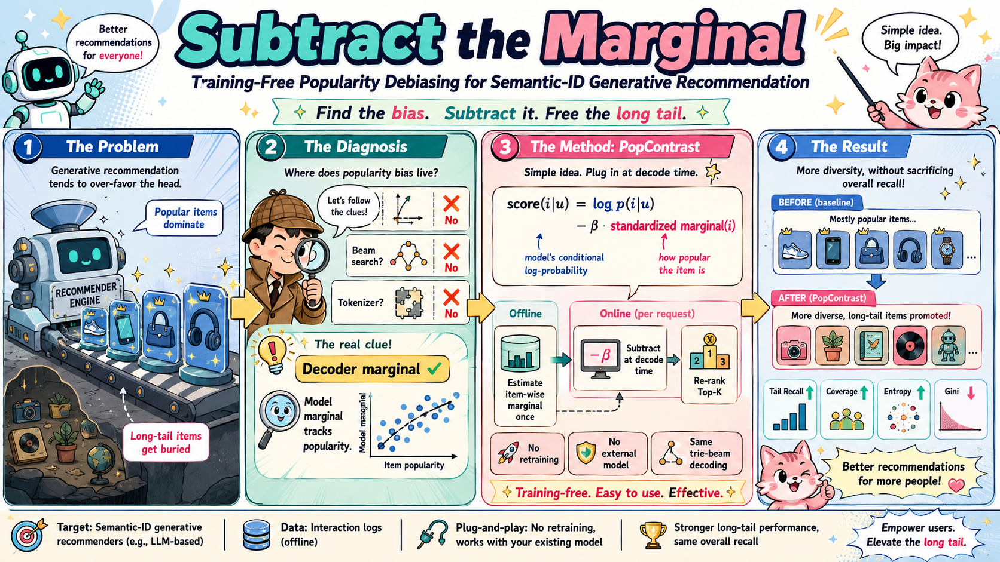
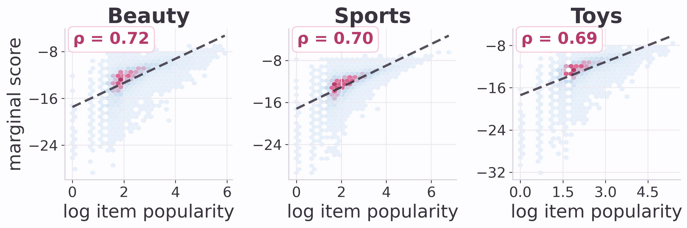
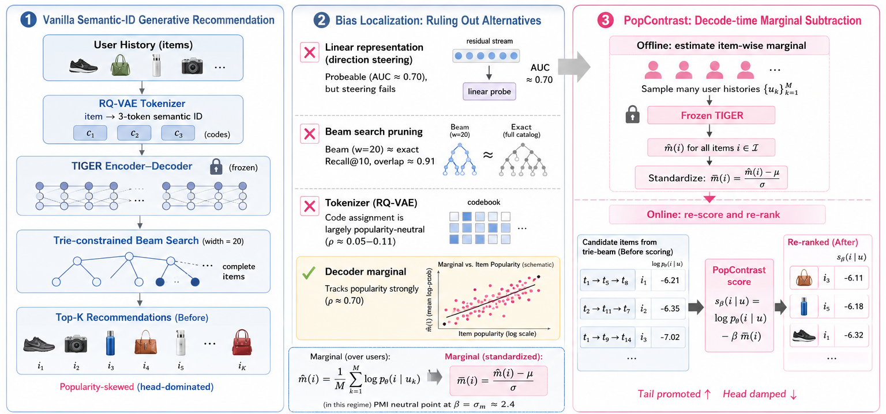
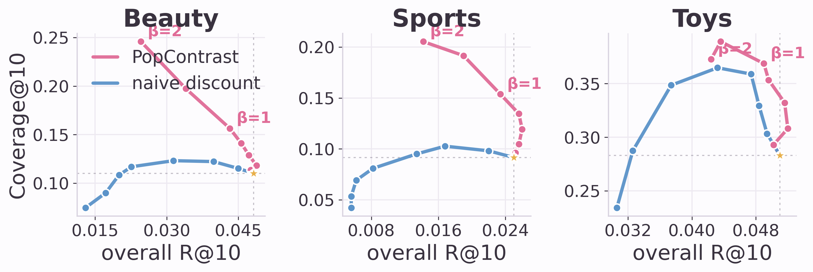
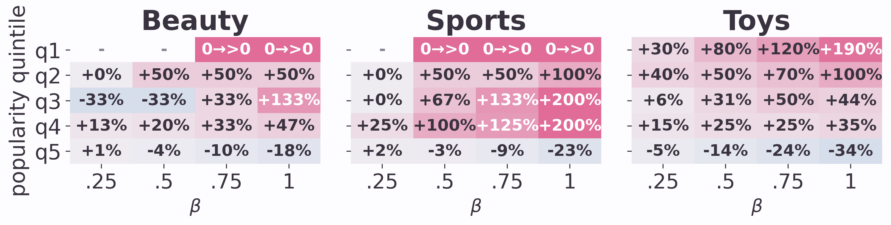
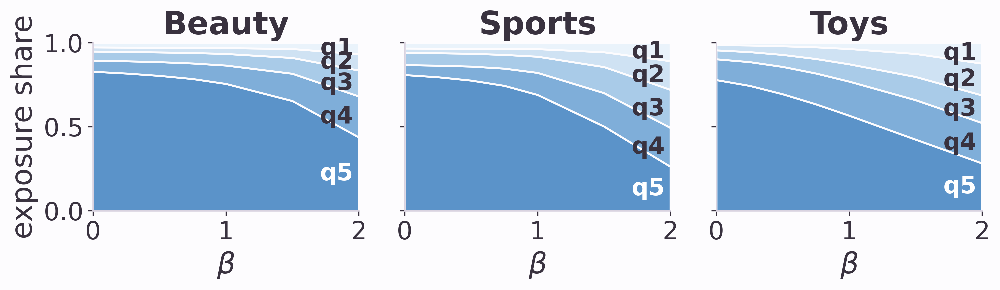
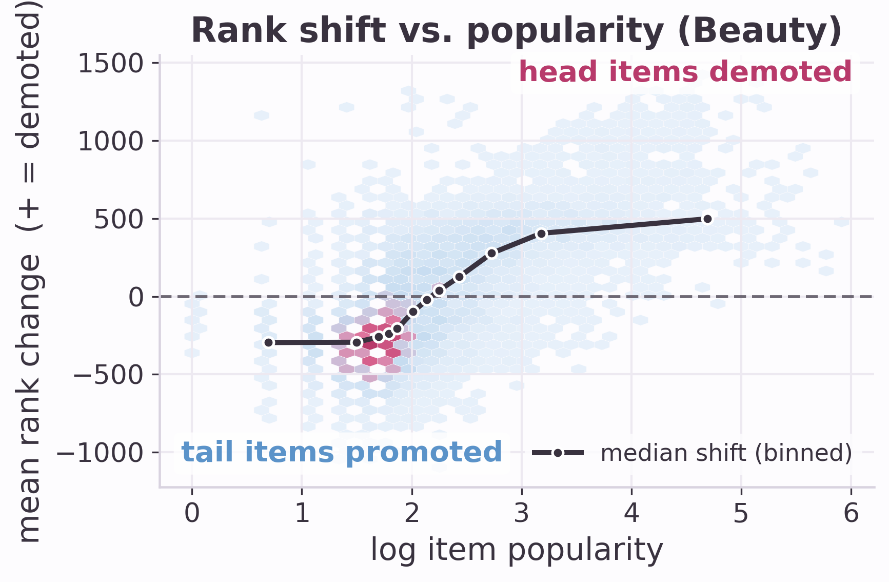

# Subtract the Marginal 🩺

**Training-Free Popularity Debiasing for Semantic-ID Generative Recommendation**

<p align="center">
  
</p>

> Semantic-ID generative recommenders (TIGER-style) over-recommend popular items and collapse long-tail coverage. We ask **where** that bias actually lives — and it is *not* where the activation-steering playbook says it should be. A ruling-out diagnosis leaves one measurable, directly correctable locus: the **decoder's learned marginal item distribution**. **PopContrast** subtracts it at decode time: no retraining, no external model, unchanged trie-beam decoding.

---

## 🔎 The Story: a Ruling-Out Diagnosis

We test every plausible location of popularity bias on a **frozen** TIGER model:

| Candidate locus | Test | Verdict |
|---|---|---|
| **Linear representation** | probes (AUC ≈ 0.70) + ~20 steering configs (CAA / probe / PCA × subtract / ablate / clamp) + closed-form **LEACE** erasure + a symmetric ±v causal test | ❌ **Probeable ≠ steerable.** Tail recall never improves; the probed direction moves output popularity by ~1% of the head–tail gap |
| **Beam-search pruning** | trie-beam (B=20) vs. exhaustive full-catalog ranking | ❌ Identical Recall@10, 91% top-10 overlap — search is not where the tail is lost (in this regime) |
| **RQ-VAE tokenizer** | code density vs. popularity, within-code entropy, collision bias, partial correlations | ❌ Code assignment is popularity-neutral (ρ ≤ 0.11); controlling for it leaves the popularity–marginal link unchanged (0.71 → 0.71) |
| **Decoder marginal** | `m̂(i) = (1/M) Σₖ log p_θ(i \| uₖ)` vs. item popularity | ✅ **Spearman ρ ≈ 0.70 on all three datasets** — measurable, and (below) directly correctable |

<p align="center">
  
</p>
<p align="center"><em>The surviving locus: the model's own marginal log-preference tracks item popularity at ρ ≈ 0.70 on every dataset — a measurable, directly correctable quantity.</em></p>

## ⚙️ The Method: PopContrast

<p align="center">
  
</p>
<p align="center"><em>(1) vanilla SID generative recommendation skews to the head; (2) the ruling-out diagnosis leaves the decoder marginal; (3) PopContrast estimates it once offline and subtracts it inside unchanged trie-beam decoding.</em></p>

Re-score each candidate at decode time by subtracting the model's **own** marginal preference:

```
s_β(i | u) = log p_θ(i | u) − β · m̄(i),      m̄ = standardized m̂
```

- **β′ = β/σ_m interpolates** from raw likelihood (β=0) to popularity-neutral **PMI ranking** (β = σ_m ≈ 2.4); any user-independent score component cancels exactly.
- **Exact inside trie-beam decoding**: with fixed-length semantic IDs the penalty attaches at complete-item leaves — no prefix approximation, serving cost unchanged. Measured: at β=0.75, a standard B=20 beam already carries 87–91% of the exact-corrected top-10; B=100 carries ~100%.
- **Self-contained**: `m̂` is one offline pass (M=512 histories, minutes on one RTX 3090; stable from M=32) — no fine-tuning, no external recommender.

## 📊 Key Results (Amazon Beauty / Sports / Toys, frozen TIGER, 5000 test users)

| Operating point | Overall R@10 | Tail R@10 | Coverage@10 |
|---|---|---|---|
| Near-free points on the frontier | held or improved on **all three** datasets | **+10% / +144% / +36%** | **+7% / +47% / +17%** |
| Uniform pre-registered **β = 0.75** (no tuning) | −5% / +2% / −3% | **+50% / +144% / +45%** | +28% / +47% / +25% |

<p align="center">
  
</p>
<p align="center"><em>Sweeping β traces a coverage–recall frontier that dominates the naive log-popularity discount: PopContrast (pink) buys coverage at little or no recall cost, where the naive baseline collapses.</em></p>

A larger, sparser fourth split (**Amazon Clothing**, ~23k items) is included as an additional replication: coverage rises steadily (+26–62%) with tail recall held flat — the correction never *hurts* the tail even where the head signal is weakest.

- **Genuine diversification**: coverage *and* entropy rise monotonically, Gini falls; exposure Lorenz curves move toward the diagonal; the top-popularity quintile's share of top-10 slots shrinks from 78–83% toward 57–75% while every lower quintile opens up.

<p align="center">
  
  
</p>
<p align="center"><em>Top: recall lifts across every non-head quintile (q1 = rarest); previously-unreachable q1 items go 0 → &gt;0. Bottom: as β grows, exposure share flows out of the dominant head quintile (q5) into the tail.</em></p>

- **Mechanism, not noise**: the correction demotes head items and promotes tail items monotonically in popularity — exactly the rank-shift a marginal subtraction predicts.

<p align="center">
  
</p>

- **Beats every decode-time alternative**: naive log-popularity discount (degenerates at strength), rank discount, Steck-style calibrated quota, group-coarsened marginals, ε-exploration (inflates coverage while *losing* tail recall — coverage alone is gameable), **MMR intra-list diversification** (raises coverage but leaves tail recall flat — PopContrast is *not* just diversifying), a **null-context / CAD-style prior** (correlates with the averaged marginal at ρ ≈ 0.92 but is a weaker estimator — averaging over real histories matters), and D³-style external-SASRec fusion (hurts every axis when the external model is weak).
- **Statistically grounded**: paired bootstrap — tail gains hold in 100%/100%/99.4% of resamples at the working points; overall changes are noise-level (that is what "near-free" means).

All figures (accuracy–coverage trajectories, exposure streams, quintile heatmaps, rank-shift mechanism, Lorenz curves, marginal-vs-popularity densities) live in [`results/figures/`](results/figures) and are regenerated by [`experiments/make_figures.py`](experiments/make_figures.py).

---

## 🗂 Repository Layout

```
popcontrast/            # library: data/popularity/trie tables, exact scoring, hooks, trie-beam
  data_utils.py         #   dataset wrapper, head/tail buckets, SID↔token tables + trie
  oracle.py             #   exact full-catalog scoring + segmented metrics (+ per-step variant)
  hidden_states.py      #   residual-stream capture & steering/ablation hooks (the negative result)
  decoding.py           #   trie-constrained beam search with per-item leaf penalties
  model_utils.py        #   TIGER checkpoint loading
experiments/            # runnable scripts (see table below)
results/                # JSON results + figures (large .pt caches are git-ignored)
assets/                 # overview + framework figures
```

| Script (`experiments/`) | What it does |
|---|---|
| `eval_popcontrast.py` | main pipeline: caches full-catalog scores per user, runs baseline / PopContrast / naive / floored / adaptive panels |
| `diagnose_probe_steering.py` | probe AUC per layer/step + steering injection sweep (the Plan-A decision gate) |
| `ablate_steering_operators.py` | CAA/probe/PCA × subtract/ablate/clamp grid |
| `diagnose_causal_steering.py` | symmetric ±v causal test |
| `rebuttal_checks.py` | LEACE erasure + marginal M-sensitivity |
| `diagnose_beam_vs_exact.py` | beam ≈ exact equivalence (the "not search" ruling) |
| `diagnose_tokenizer.py` | code density / entropy / collision diagnostics (the "not tokenizer" ruling) |
| `diagnose_marginal_popularity.py` | marginal↔popularity correlation + PMI sweep |
| `eval_beam_corrected.py` | corrected decoding **inside** the beam vs. exact re-ranking |
| `eval_validation_beta.py` | validation-based β selection protocol |
| `extra_baselines.py` | rank discount, ε-exploration, calibrated-quota baselines |
| `eval_mmr_baseline.py` | MMR intra-list diversification (is it *just* diversifying?) |
| `eval_nullcontext_baseline.py` | null-context / CAD-style prior vs. the history-averaged marginal |
| `eval_d3_comparison.py` | external-SASRec fusion (D³-style) head-to-head |
| `enrich_analysis.py` | popularity-quintile breakdown, group-coarsened priors, rank-shift data |
| `make_figures.py` | renders all figures (300 dpi PNG) |

## 🚀 Setup

```bash
# 1. environment
conda create -n popcontrast python=3.10 && conda activate popcontrast
pip install -r requirements.txt

# 2. third-party backbone library (cloned inside the repo root, git-ignored)
git clone https://github.com/phonism/genrec.git
cd genrec && pip install -e . --no-deps && cd ..

# 3. content encoder for the RQ-VAE tokenizer
hf download sentence-transformers/sentence-t5-xl --local-dir <MODELS>/sentence-t5-xl
```

**One-line patch for LC-Rec (LoRA backbone only).** genrec's `lcrec_trainer.py` enables gradient checkpointing after PEFT wrapping, which breaks LoRA backward. After `get_peft_model(...)`, add:

```python
if hasattr(model.model, "enable_input_require_grads"):
    model.model.enable_input_require_grads()
```

Amazon-2014 5-core data is downloaded automatically on first run (SNAP mirrors).

## 🏃 Reproduce

All commands run **from the `genrec/` directory** with `PYTHONPATH=<repo>:<repo>/genrec`.

```bash
# 1. train the backbone (per split: beauty / sports / toys / clothing)
python genrec/trainers/rqvae_trainer.py config/tiger/amazon/rqvae.gin --split beauty \
    --gin "MODEL_HUB_SENTENCE_T5_XL='<MODELS>/sentence-t5-xl'" --gin "train.wandb_logging=False"
python genrec/trainers/tiger_trainer.py config/tiger/amazon/tiger.gin --split beauty \
    --gin "MODEL_HUB_SENTENCE_T5_XL='<MODELS>/sentence-t5-xl'" --gin "train.wandb_logging=False"

# 2. build the score cache + main result panels  ->  results/main_panel_<split>.json
NIGHT_SPLIT=beauty python -m experiments.eval_popcontrast

# 3. the diagnosis (any order; most reuse the cache)
python -m experiments.diagnose_probe_steering        # probeable...
python -m experiments.ablate_steering_operators      # ...but not steerable
python -m experiments.diagnose_beam_vs_exact         # not the search
TOK_SPLITS=beauty python -m experiments.diagnose_tokenizer   # not the tokenizer
python -m experiments.diagnose_marginal_popularity   # it's the marginal

# 4. robustness & baselines
BC_SPLIT=beauty python -m experiments.eval_beam_corrected
python -m experiments.eval_validation_beta
python -m experiments.extra_baselines
python -m experiments.eval_mmr_baseline              # MMR diversification baseline
python -m experiments.eval_nullcontext_baseline      # null-context / CAD-style prior
python -m experiments.eval_d3_comparison             # needs a trained SASRec (genrec)

# 5. figures  ->  results/figures/*.png
python -m experiments.make_figures
```

Reference hardware: a single RTX 3090 (24 GB). TIGER trains in hours per split; every analysis above runs in minutes once the per-split score cache exists.

## 📖 Citation

The paper is under double-blind review; a citation entry will be added upon publication.

## 🙏 Acknowledgements

Backbone training builds on [phonism/genrec](https://github.com/phonism/genrec) (TIGER / LC-Rec reproductions) and the [TIGER](https://arxiv.org/abs/2305.05065) recipe with `sentence-t5-xl` item encodings.
