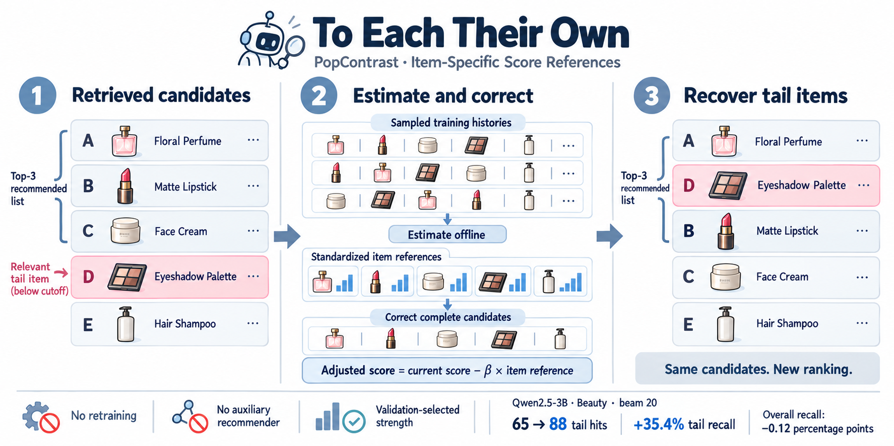
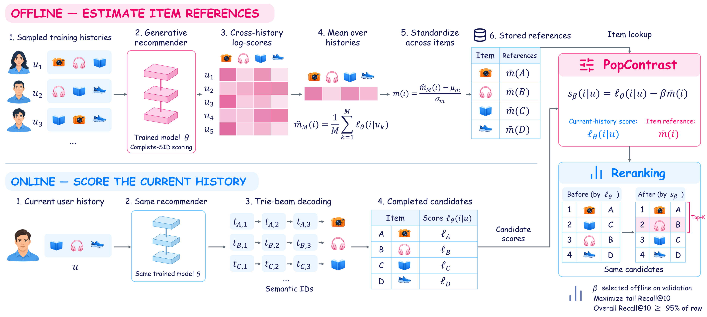
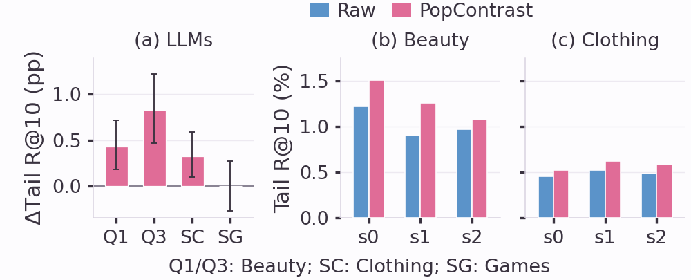
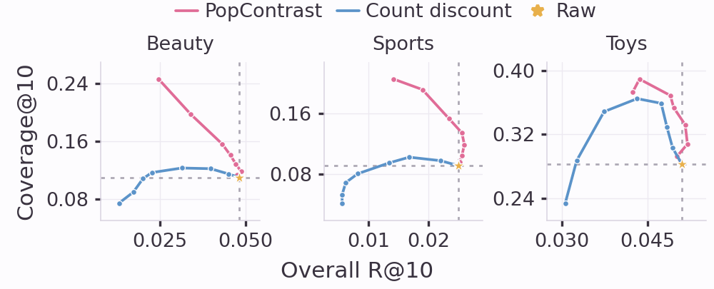

# To Each Their Own: Item-Specific Score References for Long-Tail Discovery in Generative Recommendation

This repository contains **PopContrast**, its evaluation code, and the compact result records used in the paper.

[Anonymous code and results](https://anonymous.4open.science/r/PopContrast/)

Generative recommenders can retrieve relevant long-tail candidates without placing them in the final recommendation list. PopContrast compares each complete candidate score with an item-specific reference estimated from the same model across training histories. It improves final ranking without retraining the recommender or adding an auxiliary model. Experiments examine recovery within fixed candidates, additional gains after item-supported decoding (ISD), and the accuracy, exposure, and estimation costs of different references.

<p align="center"></p>

The ranking illustration is schematic. The evidence box reports Top-10 results on Qwen2.5-3B–Beauty.

## Start here

**To inspect the reported results:** use the CPU workflow below. The repository includes aggregate figure inputs and compact evaluation records; model weights and full datasets are not required.

**To repeat training or inference:** follow [training and evaluation](#training-and-evaluation) and the [benchmark instructions](experiments/benchmark/README.md). These workflows require the corresponding datasets, model dependencies, and checkpoints.

```bash
python -m venv .venv
source .venv/bin/activate
pip install -r requirements-analysis.txt
make summaries
make figures
make check
```

The commands regenerate summaries under `results/benchmark/`, table snippets under `results/tables/`, and all ten paper figures under `results/figures/`. `make check` compares 1,155 metric values across 33 recorded settings, verifies validation-selected strengths and paired intervals, and checks source hashes. This workflow reuses recorded experiments; it does not train models or select new settings on test results.

## Method

<p align="center"></p>

For item `i`, average complete-SID scores over sampled training histories and standardize the reference across items:

```text
Geometric reference:  m_G(i) = mean_h log p(i | h)
Arithmetic reference: m_A(i) = log mean_h p(i | h)
Standardization:      z(i)   = (m(i) - mean_items(m)) / std_items(m)
Candidate correction: s(i,u) = log p(i | u) - beta * z(i)
```

`PopContrast-G` is the geometric implementation used by default in the paper; `PopContrast-A` replaces the reference estimator. A null-context reference is also evaluated. Geometric correction is invariant to item-independent score shifts within each history and has lower measured sampling variation in the five tested history banks. Arithmetic and null-context references can achieve better operating points in some settings.

The primary beam experiments choose `beta` on validation data to maximize tail Recall@10 while retaining at least 95% of raw overall Recall@10. Raw ranking is an available choice. This budget applies to validation, not a guaranteed test or user-group loss bound. Candidates, users, and tuning budgets are matched within each comparison. Correction cannot retrieve an item absent from the candidate set.

## Results in the paper

Matched width-20 retrieval measures how many already-retrieved relevant tail targets enter the final top 10:

| Model / dataset | Tail targets in candidates | Raw tail hits | Corrected tail hits |
|---|---:|---:|---:|
| Qwen2.5-3B / Beauty | 124 | 65 | **88** |
| TIGER / MovieLens-1M | 196 | 103 | **143** |

On Qwen2.5-3B–Beauty, tail recall increases **35.4%** and coverage **27.9%**, with an overall-recall change of **−0.12 percentage points**. The corresponding per-user candidate audits are stored with each run in `results/benchmark/runs/`.

Correction also improves retrieval after the statistics-based ISD adaptation expands search support:

| Dataset | ISD tail hits | ISD + PopContrast tail hits | Tail-recall change (percentage points, 95% paired CI) |
|---|---:|---:|---:|
| Beauty | 205 | **231** | +0.65 [0.35, 0.97] |
| Toys | 368 | **392** | +0.55 [0.28, 0.85] |

Each ISD comparison uses 7,000 confirmation users disjoint from the preliminary test cohort, a shared width-20 search setting, and strengths fixed from validation. The adaptation and complete comparison arms are documented in the [ISD instructions](experiments/benchmark/README.md#search-complementarity-with-isd); compact records are in `results/benchmark/isd_confirmation/`.

<p align="center"></p>

The main generative evaluation covers six TIGER datasets and four adapted LLM configurations. Beauty and Clothing each have three matched TIGER training seeds. The complete 33-setting inventory additionally includes conventional scorers and the one-epoch Books scale probe; it is not a full model-by-dataset grid. User-bootstrap intervals, variation across training seeds, and repeated reference sampling are reported separately.

Full-catalog sweeps characterize the tradeoff when every item can be ranked. They include descriptive operating points with simultaneous overall-recall, tail-recall, and coverage gains. The beam comparisons use separately recorded validation choices.

<p align="center"></p>

The stored comparisons retain geometric, arithmetic, null-context, frequency, MMR, and SASRec-fusion results, including unchanged and weaker outcomes. See [figure and table generation](experiments/figures/README.md) for the mapping from result records to plots.

## Repository map

| Path | Contents |
|---|---|
| `popcontrast/` | Dataset/SID utilities, complete-item scoring, trie decoding, and representation hooks |
| `experiments/` | Full-catalog evaluation and diagnostic experiments |
| `experiments/benchmark/` | Recorded training recipes, matched beam evaluation, reference comparisons, and ISD |
| `experiments/figures/` | Shared plotting style and paper table/figure builders |
| `results/benchmark/runs/` | Per-setting configurations, validation choices, test metrics, and numerical audits |
| `results/benchmark/isd_confirmation/` | Independent ISD confirmation results and fixed selections |
| `assets/plot_data/` | Aggregate inputs for the diagnostic plots |
| `scripts/check_results.py` | Verification of stored primary metrics and provenance |

Datasets, checkpoints, full score matrices, per-user prediction caches, local manuscript sources, and development reports are excluded from Git. They are needed only for the corresponding fresh evaluation or cache-level audits. Aggregate results alone cannot reproduce a new training run.

## Training and evaluation

Use Python 3.10 and install the model dependencies separately from the CPU analysis environment:

```bash
pip install -r requirements.txt
git clone https://github.com/phonism/genrec.git
pip install -e ./genrec --no-deps
```

TIGER, SASRec, and HSTU use the external `genrec` implementations. The adapted-LLM path is implemented in `experiments/benchmark/lcrec.py`. Download the model files required by the chosen setting into the ignored `models/` directory:

```bash
hf download sentence-transformers/sentence-t5-xl --local-dir models/sentence-t5-xl
hf download Qwen/Qwen2.5-3B-Instruct --local-dir models/Qwen2.5-3B-Instruct
export PC_ENCODER="$PWD/models/sentence-t5-xl"
```

Other recorded backbones are `Qwen/Qwen2.5-1.5B` and `HuggingFaceTB/SmolLM2-360M`. `PC_ENCODER` overrides the original-category content encoder; without it, the code uses the public `sentence-transformers/sentence-t5-xl` model identifier.

For the original Amazon-category recipe, run from `genrec/` after setting `PC_ENCODER` above:

```bash
cd genrec
python genrec/trainers/rqvae_trainer.py config/tiger/amazon/rqvae.gin --split beauty \
  --gin "MODEL_HUB_SENTENCE_T5_XL='$PC_ENCODER'" --gin "train.wandb_logging=False"
python genrec/trainers/tiger_trainer.py config/tiger/amazon/tiger.gin --split beauty \
  --gin "MODEL_HUB_SENTENCE_T5_XL='$PC_ENCODER'" --gin "train.wandb_logging=False"
PYTHONPATH=..:. PC_SPLIT=beauty python -m experiments.eval_popcontrast
cd ..
```

After producing the original score caches, export those datasets and prepare the additional datasets:

```bash
PYTHONPATH=.:genrec python -m experiments.benchmark.export_data
python -m experiments.benchmark.prepare_extended --datasets ml1m games2023 arts2023 books2023
python -m experiments.benchmark.run --list
```

Select a recorded setting and an available GPU:

```bash
python -m experiments.benchmark.run --run beauty_s1_l3_fast/evaluation --stage train --device 0
python -m experiments.benchmark.run --run beauty_s1_l3_fast/evaluation --stage evaluate --device 0
python -m experiments.benchmark.run --run lcrec_qwen3b_beauty_s1_compact/evaluation_fp32 --stage train --device 0
python -m experiments.benchmark.run --run lcrec_qwen3b_beauty_s1_compact/evaluation_fp32 --stage evaluate --device 0
```

`--print-command` displays the exact recipe without running it. `--model-root` and `--output-root` choose local model and output locations. The runner preserves recorded budgets, including the four-epoch Qwen1.5B run with its six-epoch learning-rate schedule. New outputs go to ignored runtime directories rather than overwriting the stored paper results.

The [benchmark instructions](experiments/benchmark/README.md) cover matched baseline tuning, candidate recovery, full-cohort evaluation, longer IDs, width sweeps, estimator sampling, and latency. Cache-level audits require the prediction arrays named by their commands. After installing model dependencies and `genrec`, `make test` checks scoring equivalence, stable ties, batched search, adapters, and reference estimators.

## Acknowledgments

Backbone implementations build on [genrec](https://github.com/phonism/genrec) and [TIGER](https://arxiv.org/abs/2305.05065). The ISD adaptation follows [Understanding Semantic IDs](https://arxiv.org/abs/2607.24995); its documented width and statistical-provider settings distinguish it from the original implementation.
