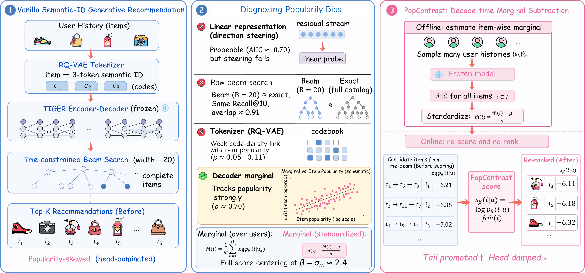
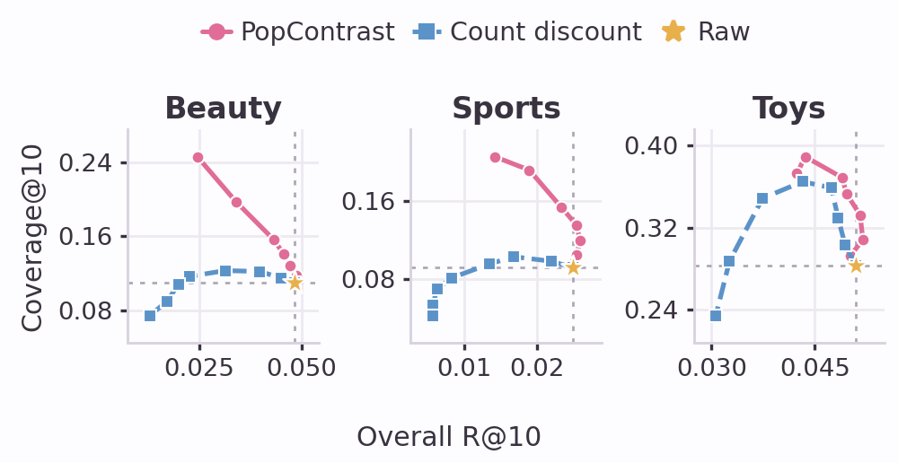
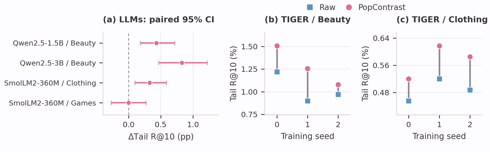
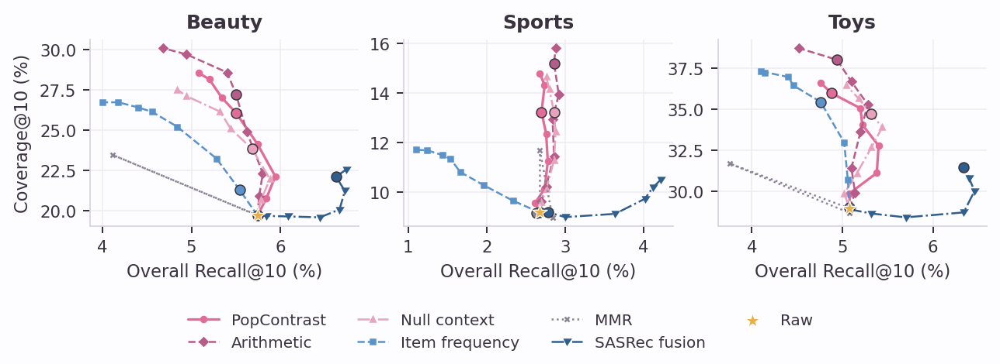
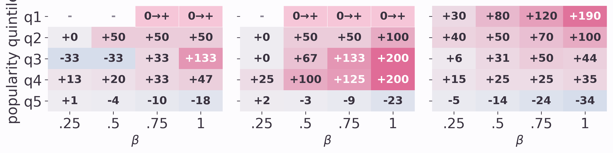
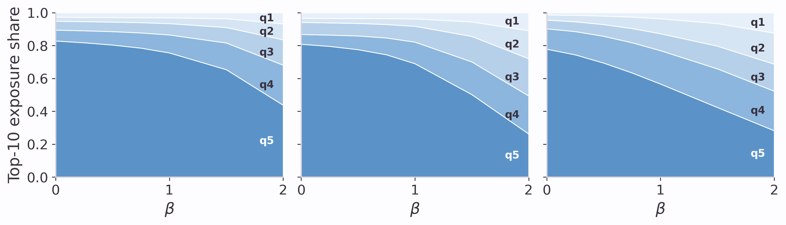

# Subtract the Marginal

**Training-Free Popularity Debiasing for Semantic-ID Generative Recommendation**

<p align="center"></p>

PopContrast improves long-tail discovery by subtracting a frozen recommender's own cross-user marginal log-preference from candidate scores. It requires no retraining or auxiliary recommender. Diagnostics on TIGER motivate this measurable correction; matched decoding experiments extend the evaluation to larger language models, conventional scorers, longer semantic IDs, and multiple training seeds.

## Method

<p align="center"></p>

For item `i` and user history `u`, estimate and standardize the mean log-score over training histories, then correct completed candidates:

```text
m(i) = mean_h log p(i | h)
z(i) = (m(i) - mean_items(m)) / std_items(m)
s_beta(i | u) = log p(i | u) - beta * z(i)
```

The geometric reference differs from the arithmetic marginal in ordinary PMI. Full score centering cancels user-independent score components; validation chooses partial correction when shared popular relevance should be retained. Within a beam's completed candidates, correction is exact. Recovering the full-catalog corrected top-10 additionally requires those items to survive candidate generation.

Online work is one lookup and scalar correction per candidate. In the recorded paired TIGER timing study, mean request latency is 12.309 ms raw and 12.335 ms corrected at beam width 20; the measured mean overhead is 0.027 ms.

## Results

The original 5,000-user full-catalog sweeps contain descriptive operating points with non-decreasing overall Recall@10:

| Dataset | Strength | Tail Recall@10 change | Coverage@10 change |
|---|---:|---:|---:|
| Beauty | 0.25 | +10% | +7% |
| Sports | 0.75 | +144% | +47% |
| Toys | 0.50 | +36% | +17% |

These points describe the test sweep. The matched beam comparisons independently select strengths on validation users, maximizing tail recall under a 5% relative overall-recall budget, with raw ranking always available.

<p align="center"></p>

The expanded benchmark includes **33 completed dataset–checkpoint settings across eight datasets and six backbone specifications**. It includes TIGER; Qwen2.5-1.5B and Qwen2.5-3B-Instruct with LoRA; SmolLM2-360M with LoRA; SASRec with next-item cross-entropy; and HSTU without time bias. These are observed settings, not a full architecture-by-dataset cross product.

- Qwen2.5-3B on Beauty: tail recall **+35.4%**, coverage **+27.9%**, and overall recall −0.12 percentage points under actual width-20 decoding.
- Matched TIGER seeds 0/1/2: positive tail-recall changes on both Beauty and Clothing. User-bootstrap intervals and training-seed variation are reported separately.
- Clothing's 39,387-user analysis preserves the frozen models and validation choices, with tail hits increasing in each of three seeds.
- Longer-ID controls and a 495,063-item Books experiment characterize search and scale. Books is a one-epoch study; its weak candidate availability is retained in the complete results.

<p align="center"></p>

All matched baseline families use the same users, candidate pools, and validation selection rule. Geometric, arithmetic, and null-context model references are compared alongside empirical counts, MMR, and auxiliary SASRec fusion.

<p align="center"></p>

The original exposure and popularity-quintile analyses remain available:

<p align="center">


</p>

## Repository

```text
popcontrast/              Shared scoring, data, trie decoding, and representation hooks
experiments/              Original full-catalog experiments and diagnostics
experiments/benchmark/    Training, paired beam evaluation, controls, and numerical audits
experiments/figures/      Shared publication plots, tables, and pink/blue style
scripts/check_results.py  Source and metric verification
assets/plot_data/         Small aggregate inputs for diagnostic figures
results/                 Original numerical results and figures
results/benchmark/       Frozen primary records, configurations, and compact summaries
```

Generated reports, training outputs, datasets, model weights, prediction caches, Python caches, and local manuscript files are ignored. The original and expanded evaluation settings remain distinguishable in the result records.

## Rebuild figures and verify results

The stored summaries and aggregate figure inputs support plotting without a GPU or model weights:

```bash
pip install numpy scipy matplotlib
make summaries
make figures
make check
```

`make summaries` reconstructs all five operating rules for each primary setting, matched baseline rows, and Clothing cohort comparisons. `make check` verifies 1,155 metric values, selected strengths, paired intervals, distinct checkpoints, and source hashes. Plot scripts retain the recorded points and do not choose settings on test performance.

## Training setup

```bash
conda create -n popcontrast python=3.10
conda activate popcontrast
pip install -r requirements.txt
git clone https://github.com/phonism/genrec.git
pip install -e ./genrec --no-deps
```

TIGER, SASRec, and HSTU reuse implementations from `genrec`. The LLM path uses the adapters and scoring implementation in `experiments/benchmark/lcrec.py`. Original-category RQ-VAE tokenization uses sentence-T5-xl item embeddings. Download model files into `models/`, which is ignored.

```bash
hf download sentence-transformers/sentence-t5-xl --local-dir models/sentence-t5-xl
hf download Qwen/Qwen2.5-1.5B --local-dir models/Qwen2.5-1.5B
hf download Qwen/Qwen2.5-3B-Instruct --local-dir models/Qwen2.5-3B-Instruct
hf download HuggingFaceTB/SmolLM2-360M --local-dir models/SmolLM2-360M
```

### Original full-catalog study

Run the original `genrec` training recipe from its directory, using an absolute path for the content encoder:

```bash
cd genrec
python genrec/trainers/rqvae_trainer.py config/tiger/amazon/rqvae.gin --split beauty \
  --gin "MODEL_HUB_SENTENCE_T5_XL='<ABSOLUTE_MODEL_DIR>/sentence-t5-xl'" --gin "train.wandb_logging=False"
python genrec/trainers/tiger_trainer.py config/tiger/amazon/tiger.gin --split beauty \
  --gin "MODEL_HUB_SENTENCE_T5_XL='<ABSOLUTE_MODEL_DIR>/sentence-t5-xl'" --gin "train.wandb_logging=False"
PYTHONPATH=..:. PC_SPLIT=beauty python -m experiments.eval_popcontrast
```

Repeat for Sports, Toys, and Clothing. Exact score caches feed the original diagnostics and full-catalog controls:

| Module under `experiments` | Purpose |
|---|---|
| `diagnose_probe_steering`, `ablate_steering_operators`, `diagnose_causal_steering` | Linear probes and representation interventions |
| `diagnose_erasure_estimation` | LEACE and marginal-history-count sensitivity |
| `diagnose_beam_vs_exact` | Raw beam versus exhaustive ranking |
| `diagnose_marginal_popularity`, `diagnose_tokenizer` | Marginal coupling and tokenizer statistics |
| `eval_validation_beta` | Validation-selected correction strength |
| `extra_baselines`, `enrich_analysis` | Quotas, exploration, group priors, quintiles, and rank changes |

The diagnostics are scoped to the tested interventions; they identify a useful correction target without proving a unique causal origin of popularity bias.

### Expanded benchmark

From the repository root, export the original datasets after building their original score caches, and prepare the additional datasets:

```bash
PYTHONPATH=.:genrec python -m experiments.benchmark.export_data
python -m experiments.benchmark.prepare_extended --datasets ml1m games2023 arts2023 books2023
python -m experiments.benchmark.run --list
```

Run a recorded setting with an explicitly chosen GPU:

```bash
python -m experiments.benchmark.run --run beauty_s1_l3_fast/evaluation --stage train --device 0
python -m experiments.benchmark.run --run beauty_s1_l3_fast/evaluation --stage evaluate --device 0
python -m experiments.benchmark.run --run lcrec_qwen3b_beauty_s1_compact/evaluation_fp32 --stage train --device 0
python -m experiments.benchmark.run --run lcrec_qwen3b_beauty_s1_compact/evaluation_fp32 --stage evaluate --device 0
```

Use `--print-command` to inspect the exact module and arguments, `--model-root` for local base models, and `--output-root` for new training outputs. Conventional scorers train and evaluate in one `--stage train` command. The runner retains recorded training budgets; Qwen1.5B's four-epoch run keeps its original six-epoch learning-rate schedule. It does not overwrite frozen result records.

See [benchmark commands and controls](experiments/benchmark/README.md) for baseline tuning, full-cohort evaluation, width sweeps, estimator sampling, and audits.

## Tests

After installing the model dependencies and `genrec`, run `make test`. The CPU suite checks cache/direct-score equivalence, stable ties, batched search, SID gradients and adapter reloads, history samplers, and geometric-reference identities.

Backbone implementations build on [phonism/genrec](https://github.com/phonism/genrec) and the [TIGER recipe](https://arxiv.org/abs/2305.05065).
